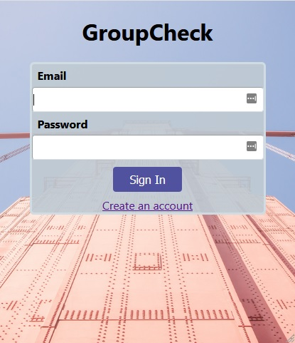
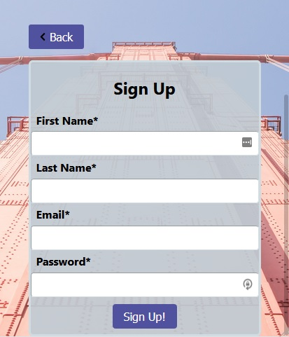
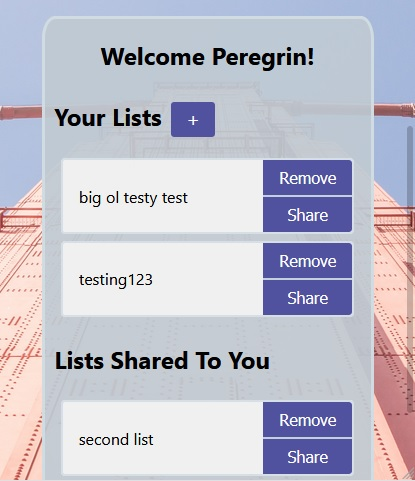
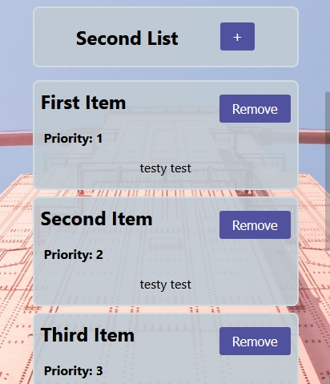
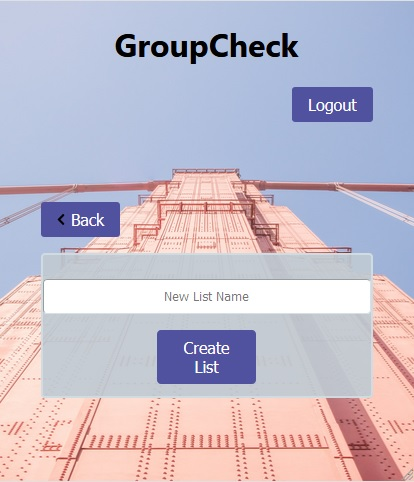
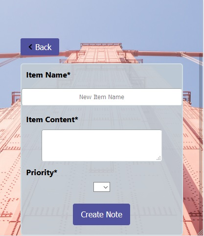
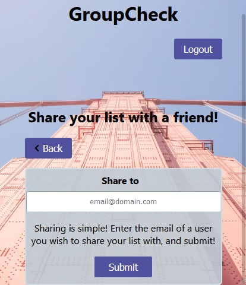

<h1>GROUPCHECK</h1>

 Enables users to create itemized lists, and share lists to other users for task/supply communication

<h2>Live Link:</h2>

https://groupcheck.jonretchless.now.sh

<h2>Screenshots:</h2>
<ul>
    <li>
        Login
         
        
    </li>
    <li>
        Signup
         
        
    </li>
    <li>
        Homepage
         
        
    </li>
    <li>
        List Main
         
        
    </li>
    <li>
        Add List
         
        
    </li>
    <li>
        Add Item
         
        
    </li>
    <li>
        Share List
         
        
    </li>
</ul>
 
 
<h2>Tech Used:</h2>
<ul>
    <li>React</li>
    <li>JS</li>
    <li>Node</li>
    <li>Express</li>
    <li>Postgres</li>
</ul>
 
 
<h2>API Documentation:</h2>
<ul>
    "/api/items/:list_id"
    <li>
        GET: get list items
    </li>
    <li>
        POST: add item to list
    </li>
</ul>
<ul>
    "/api/items/:list_id/:item"
    <li>
        DELETE: remove item
    </li>
</ul>
<ul>
    "/api/lists/"
    <li>
        GET: get user lists
    </li>
    <li>
        POST: add list
    </li>
</ul>
<ul>
    "/api/lists/:list_id"
    <li>
        DELETE: remove list
    </li>
</ul>
<ul>
    "/api/lists/shared"
    <li>
        GET: get lists shared to user
    </li>
</ul>
<ul>
    "/api/share/:email"
    <li>
        GET: retrieve user using email
    </li>
</ul>
<ul>
    "/api/share/:user_id/:list_id"
    <li>
        POST: add list to another user's shared lists
    </li>
</ul>
<ul>
    "/api/users/"
    <li>
        POST: add new user
    </li>
</ul>
<ul>    
    "/api/users/:user_id"
    <li>
        GET: return user
    </li>
    <li>
        DELETE: delete user
    </li>
    <li>
        PATCH: update user information
    </li>
</ul>
<ul>
    "/api/login"
    <li>
        POST: add user to session auth
    </li>
</ul>
<ul>
    "api/logout"
    <li>
        GET: set session user to null
    </li>
</ul>
